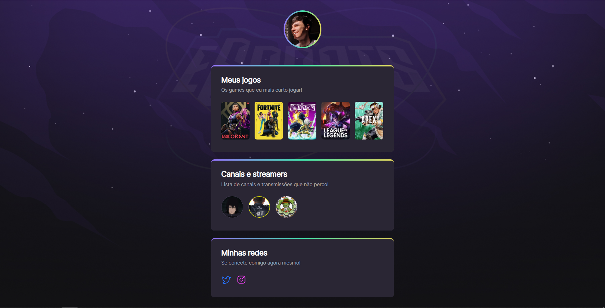

<h1 align = "center">PROJETO NLW ROCKETSEAT</h1>

# 📌 Index
   * [Sobre](#sobre)
   * [Tecnologias](#tecnologias)
   * [Link](#link)
   * [Contato](#contato)
    
---
#  Sobre

Esse projeto é um agregador de links para mostrar os jogos, streamers que eu mais gosto e como podemos nos conectamos.

Com esse projeto da Rocketseat aprendi várias coisas novas, exemplos, criar animações, a tag section do HTML, criar bordas em gradiente, a função :nth-child().Projeto muito bacana e me agregou muito!!

Obrigado ❤️ [Maykbrito](https://github.com/maykbrito)

---
#  Tecnologias

- [HTML5](https://developer.mozilla.org/pt-BR/docs/Web/HTML)
- [CSS3](https://developer.mozilla.org/pt-BR/docs/Web/CSS)

---
#  Link

- [Link do Projeto](https://nlw-iota.vercel.app/)

---
#  Contato
- gui.strabehonorio@outlook.com
