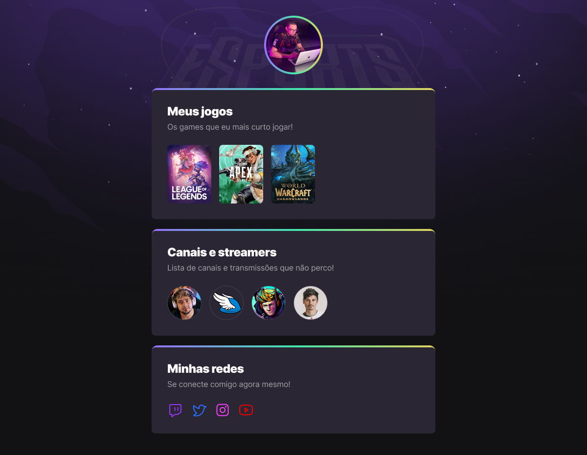

<h1 align = "center">PROJETO NLW ROCKETSEAT</h1>

# Index
   * [Sobre](#sobre)
   * [Tecnologias](#tecnologias)
   * [Aulas](#aulas)

---
# Sobre

Esse projeto é um agregador de links para procurar pessoas para jogar junto, criar amizades e etc.

---
# Tecnologias

- [HTML5](https://developer.mozilla.org/pt-BR/docs/Web/HTML)
- [CSS3/SASS](https://developer.mozilla.org/pt-BR/docs/Web/CSS)
- [JavaScript](https://developer.mozilla.org/pt-BR/docs/Web/JavaScript)

---
# Aulas

Aqui vou mostrar o progresso do projeto ao decorrer das 5 aulas

Aula 02 (aula 01 não teve código)

Nessa aula a gente fez a estruturação da página inteira, colocando a parte dos games, streamers e as redes sociais.

